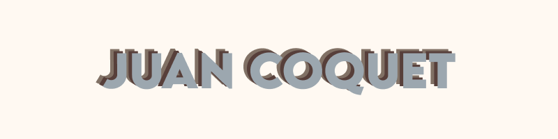

Software Engineer specialising in Python. Interested in AI and Machine Learning.

See [my website](https://www.juancoquet.com) for more information!

<h1 align="center">Projects</h1>
<table bordercolor="#66b2b2">
  
  <tr>
    <td width="50%" valign="top">
      <h3 align="center">Goal Lens</h3>
         
        
         
        

          
    
  
      

        
<strong>Python, Django, Docker, AWS, Pandas, JavaScript, HTML, CSS</strong> – A prediction model for Europe's top 5 football leagues.

    </td>
    <td width="50%" valign="top">
      <h3 align="center">Time of Your Life</h3>
         
      
         
        

          
  
  
      

        
<strong>Python, Django, JavaScript, Docker, AWS, HTML, CSS</strong> – An introspective, 90-year life calendar app.

    </td>
  </tr>

  <tr>
    <td width="50%" valign="top">
      <h3 align="center">Note Adder</h3>
         
        
         
        

          
    
  
      

        
<strong>JavaScript, Python, Django, Docker, Node.js, HTML, CSS</strong> – An audiovisual tool to help beginner musicians learn and develop intuitions about rhythmic music notation.

    </td>
    <td width="50%" valign="top">
      <h3 align="center">Personal Website</h3>
         
      
         
        

          
  
  
      

        
<strong>JavaScript, Python, Django, Docker, HTML, CSS</strong> – My personal website, made to showcase my work.

    </td>
  </tr>
</table>
